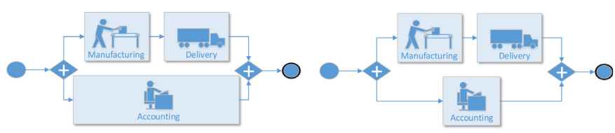

# Time Drift Detection in Business Process Event Streams

## Description of Objective
Changes - be it internal or external - affect the organization's workflows and therefore the data recorded. This work focuses on detecting concept drifts in the execution time of a business process - the time perspective - in a streaming environment. Fig. shows a graphic visualization of the problem using a simplified production process. Activities in the process are represented as blue boxes. Each product has to be manufactured, delivered and accounted for. However, accounting can be done parallel to manufacturing and delivering, as shown in the concurrent branches. The length of the boxes indicates the execution time needed for this particular activity. From the left process to the right there is a tremendous change in the execution time of the accounting activity indicating a concept drift in the time perspective in this particular process. In this we work we aim to propose a novel solution for the problem of finding and distinguishing different drift types in a stream of events. We leverage an existing concept drift detection Process Histories [1] method and map the algorithmn onto another dimension of analysis. We will develope the algorithmn on synthetic data and test the efficiency on real-world datasets.

(Note: This picture is taken from the publication:Richter, F., & Seidl, T. (2017). TESSERACT: time-drifts in event streams using series of evolving rolling averages of completion times. In Business Process Management: 15th International Conference, BPM 2017, Barcelona, Spain, September 10–15, 2017, Proceedings 15 (pp. 289-305). Springer International Publishing. )

[1] Stertz, F., & Rinderle-Ma, S. (2018). Process histories-detecting and representing concept drifts based on event streams. In On the Move to Meaningful Internet Systems. OTM 2018 Conferences: Confederated International Conferences: CoopIS, C&TC, and ODBASE 2018, Valletta, Malta, October 22-26, 2018, Proceedings, Part I (pp. 318-335). Springer International Publishing.

## Process Mining on System Logs
The system itself logs data when processing Event streams. Every function will be a own activity in our "process" and therefore be logged as events when called. When then mine a model with the inductive miner to vizualize the different function executions and how they interact with each other. The csv data and the output petri-net from the inductive miner can be found in the logs folder.

## Prerequisites

Before you begin, ensure you have met the following requirements:
- Docker installed on your machine. You can download Docker Desktop for Windows and Mac from [Docker Hub](https://hub.docker.com/?overlay=onboarding).
- Python 3.x
- pip (Python package manager)

## Installation

To install the project, follow these steps:

1. Clone the repository to your local machine:
     git clone https://github.com/joris68/Concept-Drift-Detection-Event-Stream.git

2.  Navigate into the project directory:
     cd yourprojectname

## Usage with Docker

Here's how to run the project in a Docker container:

1. Build the Docker image:
     docker build -t yourprojectname .

2. Once the image is built, run the Docker container:
     docker run -p 4000:80 yourprojectname

## Usage with Virtual Environment
1. python -m venv venv

2. venv\Scripts\activate

3. pip install -r requirements.txt

4. python src/Main.py

## Contributing to the Project

1. Create a pull request

## License

This project is under Apache License 2.0